# SSHConfig for PinePhone and Linux PC(x86_64)

# Preface  
SSHConfig is software that allows you to configure SSH configuration files on GUI.  
*It is created in Qt 5.15, so it requires Qt 5.15 library.*  
 
This article uses Manjaro ARM(AArch64) and SUSE Linux Enterprise(x86_64).  
<u>you should be able to install it on other Linux distributions as well.</u>  
(Ex. Mobian, Fedora, Debian, ... etc)  
 
**Note:**  
**Currently, "AcceptEnv", "Subsystem", and "Match" keywords are not supported.**  
**These settings can be written from the SSHConfig <I>"editor"</I> function.**  
 

<I>**I recommend using openSSH version 8.4 or later.**</I>  
If you want to know which version of openSSH you are using, execute following command in terminal.  

    ssh -V
 
 

# 1. Install the necessary dependencies for SSHConfig
Common to Linux PC, PinePhone.  
 

* Qt5 Core
* Qt5 Gui
* Qt5 Widgets
* Qt5 D-Bus
* Qt5 Concurrent
* Qt5 Quick
* Qt5 QuickControls2
* Qt5 Qml
* Qt5 QmlModels
* Qt5 Network  (Use libRemoteWindow.so, SSHConfigServer)
* Qt5 Linguist (Translation)
  * <https://www.qt.io/>  
  * This software uses Qt, and Qt used is under LGPL license.  
  * You will find its license file in following directory.  
    <I>**ThirdPartyLicenses/Qt.txt**</I>  
 

* Polkit-Qt1  (Use SSHConfigHelper)
  * <https://api.kde.org/polkit-qt-1/html/>  
  * This software uses Polkit-Qt1, and Polkit-Qt1 used is under LGPL license.  
  * You will find its license file in following directory.  
    <I>**ThirdPartyLicenses/Polkit-Qt1.txt.txt**</I>  
 

* Polkit  (Use SSHConfigHelper)
  * <https://www.freedesktop.org/software/polkit/docs/latest/>  
  * Polkit-Qt1 uses Polkit, and Polkit used is under LGPL license.  
  * You will find its license file in following directory.  
    <I>**ThirdPartyLicenses/Polkit.txt**</I>  
 

* <del>libbsd  (Use SSHConfigServer)</del>  *(Currently not used)*
  * <del><https://libbsd.freedesktop.org></del>  
  * <del>This software uses a portion of libbsd, and the portion of libbsd used is under ISC license.</del>  
  * <del>You will find its license file in following directory.</del>  
    <del><I>**ThirdPartyLicenses/libbsd_readpassphrase.txt**</I></del>  
 

Get the latest updates.  

    sudo zypper update

    sudo dnf update
    
    sudo apt update && sudo apt upgrade
    
    sudo pacman -Syu  
 

Install the dependencies required to build the **SSHConfig** and **SSHConfig Server**.  

    # SUSE Linux Enterprise / openSUSE
    sudo zypper install \
                coreutils gcc cmake polkit-devel libpolkit-qt5-1-devel \
                libqt5-qtbase-common-devel libqt5-linguist libqt5-linguist-devel \
                libQt5Core-devel libQt5Gui-devel libQt5Widgets-devel libQt5DBus-devel \
                libQt5QuickControls2-devel libQt5Network-devel libQt5Xml-devel \
                libQt5Concurrent-devel libqt5-qtdeclarative-tools

    # Fedora
    sudo dnf install \
             gcc coreutils cmake polkit-devel polkit-qt5-1-devel \
             qt5ct qt5-linguist qt5-qtdeclarative-devel \
             qt5-qtbase-devel qt5-qtquickcontrols2-devel qqc2-desktop-style

    # Debian Bullseye
    sudo apt install \
             gcc coreutils cmake \
             libpolkit-agent-1-dev libpolkit-gobject-1-dev libpolkit-qt5-1-dev \
             qt5-qmake qt5-qmake-bin qttools5-dev-tools qt5ct \
             qtdeclarative5-dev qtdeclarative5-dev-tools \
             qtbase5-dev qtbase5-dev-tools qtquickcontrols2-5-dev\
             qml-module-qtquick2 qml-module-qtquick-window2 qml-module-qtquick-controls2 qml-module-qtquick-controls \
             qml-module-qtquick-layouts qml-module-qtquick-dialogs qml-module-qt-labs-settings qml-module-qt-labs-platform

    # Manjaro (for x64)
    sudo pacman -S --needed \
                pkgconfig coreutils gcc cmake polkit polkit-qt5 \
                qt5ct qt5-tools qt5-base qt5-quickcontrols2 qt5-declarative qt5-wayland \
                qml-material

    # Manjaro ARM (for PinePhone)
    sudo pacman -S --needed \
                pkgconfig coreutils gcc cmake polkit polkit-qt5 \
                qt5ct qt5-tools qt5-base qt5-quickcontrols2 qt5-declarative qt5-wayland \
                qml-material
 
 

# 2. Compile & Install SSHConfig
Download the source code from SSHConfig's Github.  

    git clone https://github.com/presire/SSHConfig.git SSHConfig

    cd SSHConfig

    mkdir build && cd build
 

Use the "qmake" or "cmake" command to compile the source code of SSHConfig. 
The default installation directory is <I>**/usr/local**</I>. 

In the following example, the installation directory is the home directory. (Ex. <I>**~/InstallSoftware/SSHConfig**</I>)

    # for PC
    qmake ../SSHConfigTop.pro prefix=<The directory you want to install in>
       or
    qmake-qt5 ../SSHConfigTop.pro prefix=<The directory you want to install in>
       or
    cmake -DCMAKE_INSTALL_PREFIX=<The directory you want to install in> \
          ..

    # for PinePhone
    qmake ../SSHConfigTop.pro machine=pinephone prefix=<The directory you want to install in>
       or
    cmake -DMACHINE=pinephone -DCMAKE_INSTALL_PREFIX=<The directory you want to install in> \
          ..

    make -j $(nproc)

    make install
        or
    sudo make install
 

    # If you are installing to any directory.
    cd <path to SSHConfig directory>/share/applications

    cp SSHConfig.desktop  ~/.local/share/applications
       or
    sudo cp SSHConfig.desktop  /usr/share/applications
 

First, check if SSHConfig Polkit action file exists <I>**/usr/share/polkit-1/actions/org.presire.sshconfig.policy**</I>.  
If SSHConfig is installed in arbitrary directory, copy the Polkit action file in <I>**/usr/share/polkit-1/actions**</I> directory.  

    sudo cp /<SSHConfig installation directory>/share/polkit-1/actions/org.presire.sshconfig.policy \
            /usr/share/polkit-1/actions
 

Next, check if SSHConfig D-Bus startup file exists <I>**/usr/share/dbus-1/system-services/org.presire.sshconfig.service**</I>.  
If SSHConfig is installed in arbitrary directory, copy the D-Bus startup file in <I>**/usr/share/dbus-1/system-services**</I> directory.  

    sudo cp /<SSHConfig installation directory>/share/dbus-1/system-services/org.presire.sshconfig.service \
            /usr/share/dbus-1/system-services
 

Last, check if SSHConfig D-Bus Configuration file (for System Bus) exists <I>**/usr/share/dbus-1/system.d/org.presire.sshconfig.conf**</I> directory.  
If SSHConfig is installed in arbitrary directory, copy the D-Bus Configuration file in <I>**/usr/share/dbus-1/system.d**</I> directory.  

    sudo cp /<SSHConfig installation directory>/share/dbus-1/system.d/org.presire.sshconfig.conf \
            /usr/share/dbus-1/system.d
 
 

# 3. Compile & Install SSHConfig Server
On remote server running ssh, download source code from SSHConfig's Github. 

    git clone https://github.com/presire/SSHConfig.git SSHConfig

    cd SSHConfig/SSHConfigServer

    mkdir build && cd build
 

Use the "qmake" or "cmake" command to compile the source code of SSHConfig.  
The default installation directory is <I>**/usr/local**</I>.  
 
Default installation location of **SSHConfigServer** configuration file is <I>**/etc/sshconfig/sshconfig.json**</I>.  
Also, default installation location of Systemd service file for **SSHConfigServer** is <I>**/etc/systemd/system/sshconfigd.service**</I>.  

    # for PC and PinePHone
    qmake ../SSHConfigServer.pro prefix=<The directory you want to install in>
        or
    cmake -DCMAKE_INSTALL_PREFIX=<The directory you want to install in> \
          ..

    make -j $(nproc)
    make install
 

The following build options also exist for SSHConfigServer builds.  

* **sysconfdir** (qmake) or **-DSYSCONFDIR** (cmake)  
  Specify path to SSHConfigServer configuration file is located.  

* **systemd** (qmake) or **-DSYSTEMD** (cmake)  
  Specify path to systemd service of SSHConfigServer is located.  

* **user** (qmake) or **-DUSER** (cmake)  
  Specify user who executes systemd service of SSHConfigServer.  

* **group** (qmake) or **-DGROUP** (cmake)  
  Specify group who executes systemd service of SSHConfigServer.  

* **pid** (qmake) or **-DPID** (cmake)  
  Specify PID when systemd service of SSHConfigServer is executed.  
 

For example, following build command modifies configuration file (~/config/sshconfig) and process ID file (/tmp/SSHConfigServer.pid).  

    qmake ../SSHConfigServer.pro prefix=<The directory you want to install in>
                                 sysconfdir=$HOME/config/sshconfig pid=/tmp
        or
    cmake -DCMAKE_INSTALL_PREFIX=<The directory you want to install in> \
          -DSYSCONFDIR=$HOME/config/sshconfig -DPID=/tmp
          ..
 

Reload daemon after installation.  
Or, restart server.

    sudo systemctl daemon-reload  
        or  
    sudo systemctl restart  (sudo shutdown -r now)  
 

To start SSHConfigServer, execute following command.  

    sudo systemctl start sshconfigd.service
        or
    sudo systemctl restart sshconfigd.service
 

To start SSHConfigServer automatically at server startup, do the following.  

    sudo systemctl enable sshconfigd.service
 

Alternatively, SSHConfig Server can be started by executing following command on terminal.  

    sudo SSHConfigServer --sysconfdir=<Directory sshconfig.json is located>
       or
    sudo SSHConfigServer --sysconfdir=<Directory sshconfig.json is located> --locale=jp
 
 

# 4. SSHConfig and SSConfig Server settings
## 4.1 SSHConfig settings
SSHConfig configuration file is located in <I>**~/.config/SSHConfig/settings.ini**.</I>  
This file describes main screen settings and server connection settings.  

 

## 4.2 SSHconfig Helper
In the <I>**/usr/share/dbus-1/system-services/org.presire.sshconfig.service**</I>,  
adding **--locale=jp** option to **Exec** keyword will cause SSHConfigHelper's messages output will be in Japanese.  

    [D-BUS Service]  
    Name=org.presire.sshconfig
    Exec=/path/to/SSHConfigHelper --locale=jp
    User=root
 

**attention (heed)**  
**If you are using SELinux (Fedora, etc...), you must change the SELinux settings or temporarily disable SELinux as shown below.**  

    sudo setenforce 0
 

## 4.3 SSHConfig Server settings
**/etc/sshconfig/sshconfig.json**  
<u>It is recommended that permissions on this file be set to 600.</u>  
 

* PORT  
  Port number used for TCP or SSL connections.  

* USESSL  
  Whether to use SSL connection.

* USECERT  
  Whether to use server certificate when SSL connection.  

* CERTFILE  
  Full path to server certificate when using server certificate.  
  
* USEKEY  
  Whether to use the private key when SSL connection.  

* KEYFILE  
  Full path to private key when using private key.  

* USEPASSPHRASE  
  Whether to use passphrase when using private key.  

* PASSPHRASE  
  Input passphrase when using private key.  
 

    {  
        "PORT": {  
            "value": 61060  
        },  
        "USESSL": {  
            "value": false  
        },  
        "USECERT": {  
            "value": false  
        },  
        "CERTFILE": {  
            "value": ""  
        },  
        "USEKEY": {  
            "value": false  
        },  
        "KEYFILE": {  
            "value": ""  
        },  
        "USEPASSPHRASE": {  
            "value": false  
        },  
        "PASSPHRASE": {  
            "value": ""  
        },   
    }  
 

<h2><I>*  Important  *</I></h2>  
Open a firewall port on remote server.  

    sudo firewall-cmd --permanent --add-port=<Port Number>/tcp

    # Ex. The default port of the SSHConfig server is open.  
    sudo firewall-cmd --permanent --add-port=61060/tcp
 

Reload changes in the firewall.  

    sudo firewall-cmd --reload
 

## 4.4 sshd_config format
For SSHConfig application, format of sshd_config file shall follow rules below.  
 

    --Enable item--
    Port 22
       Port 22    # Blank spaces may be present at the beginning of item.
    Port      22  # Any number of blank spaces are allowed.

    --Commented item--
    When commenting item, must be no space between "#" and item name.

    #Port 22       # Correct.
    #Port      22  # Correct.
    # Port 22      # Worst.

    --Comment statement--
    Comment text should have at least one space between "#" and comment text.

    # This is comment statement      # Correct.
    #     This is comment statement  # Correct.
    #This is comment statement       # Worst.
 

**ChallengeResponseAuthentication** is deprecated and **KbdInteractiveAuthentication** is recommended instead.  
SSHConfig application follows rules below.  

    # If both are commented or not described,  
    # changes are made to KbdInteractiveAuthentication.  

    #ChallengeResponseAuthentication yes
    #KbdInteractiveAuthentication    yes

    # If ChallengeResponseAuthentication is enabled and KbdInteractiveAuthentication commented,  
    # changes are made to ChallengeResponseAuthentication.  

    ChallengeResponseAuthentication yes
    #KbdInteractiveAuthentication    yes

    # If both are enabled,  
    # then, ChallengeResponseAuthentication is commented and  
    # changes are made to KbdInteractiveAuthentication.  

    ChallengeResponseAuthentication yes
    KbdInteractiveAuthentication    yes
 
 

# 5. Execute SSHConfig
Make sure you can execute **SSHConfig**.  
(Destop entry or SSHConfig.sh or SSHConfig binary)  
 

**Note:**  
**To run the SSHConfig binary directly, add directory containing libRemoteWindow.so to "LD_LIBRARY_PATH" environment variable.**  
 

## 5.1 **For PC**
### Main screen  
|SSHConfig Main (Server Mode)|SSHConfig Main(1) (Client Mode)|SSHConfig Main(2) (Client Mode)|
|---|---|---|
|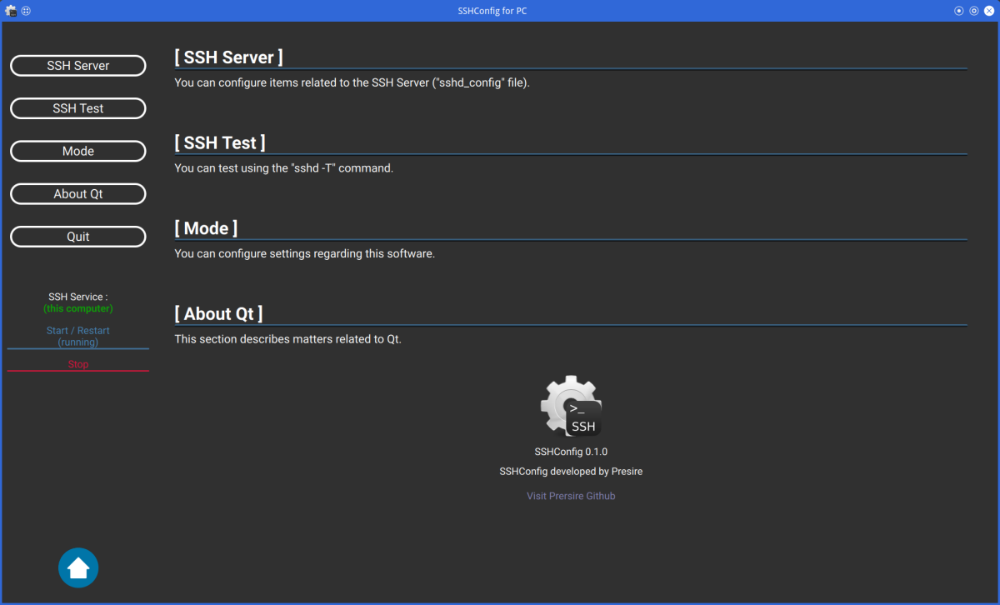|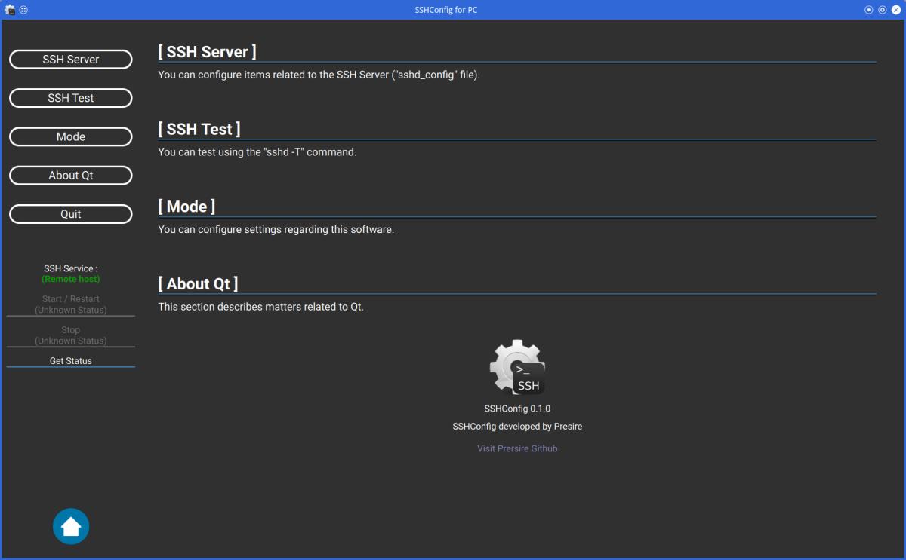|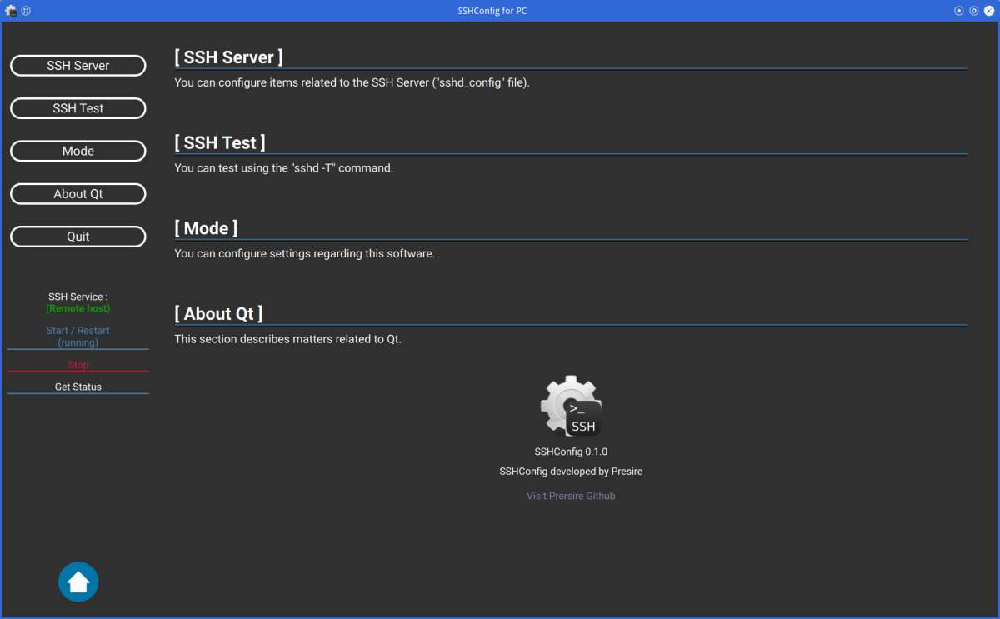|
 

Select the item you wish to set from buttons on the left side of main screen.  
You can start (restart) and stop SSH by clicking on the labels under the buttons.  

To start (restart) and stop SSH on remote server, you must enter the remote connection settings.  
 

You can return to Home Screen by pressing [Home] button or [Shift] + [Esc] buttons.  
 

If your mouse has [Forward] or [Back] button, you can go back and forward through each menu screen.  
 

### Edit ssh configuration  
|SSHConfig Configuration(1) (Server Mode)|SSHConfig Configuration(2) (Server Mode)|SSHConfig Configuration(3) (Server Mode)|
|---|---|---|
|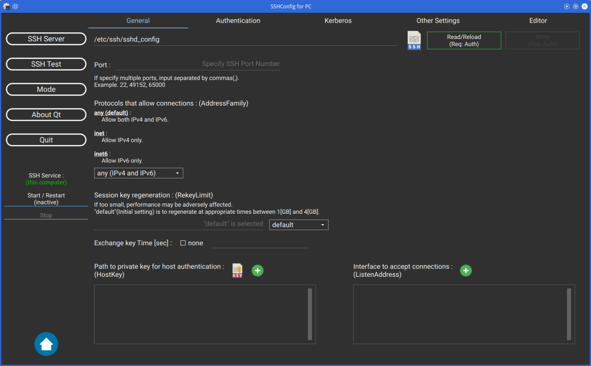|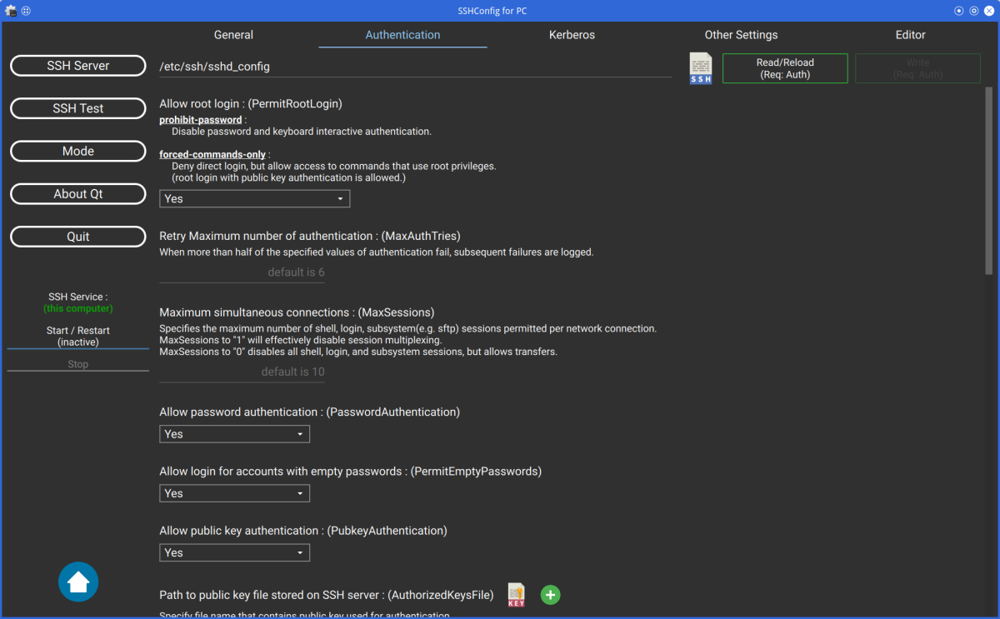|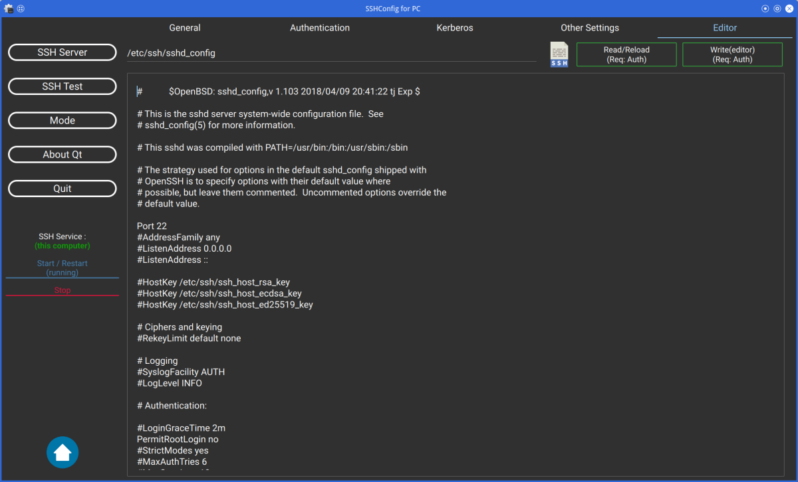|
 

Click the [SSH Server] button to configure various SSH settings.  
 

Currently, "AcceptEnv", "Subsystem", and "Match" keywords are not supported.  
These settings can be written from the <I>"editor"</I> tab.  
 

**When select the "Editor" tab, write button name is "Write (Editor)".**  
**This means that only changes made in the "Editor" tab will be written.**  
 

If you configure SSH on remote server, click the file icon and select the sshd_config file on remote server.  
 

|SSHConfig Configuration(1) (Client Mode)|SSHConfig Configuration(2) with SSL/TLS (Client Mode)|SSHConfig Configuration(3) (Client Mode)|
|---|---|---|
|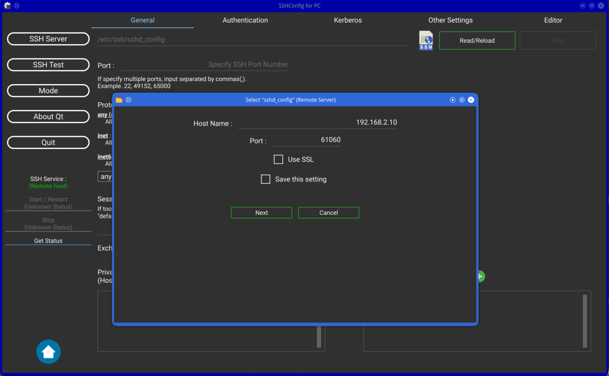|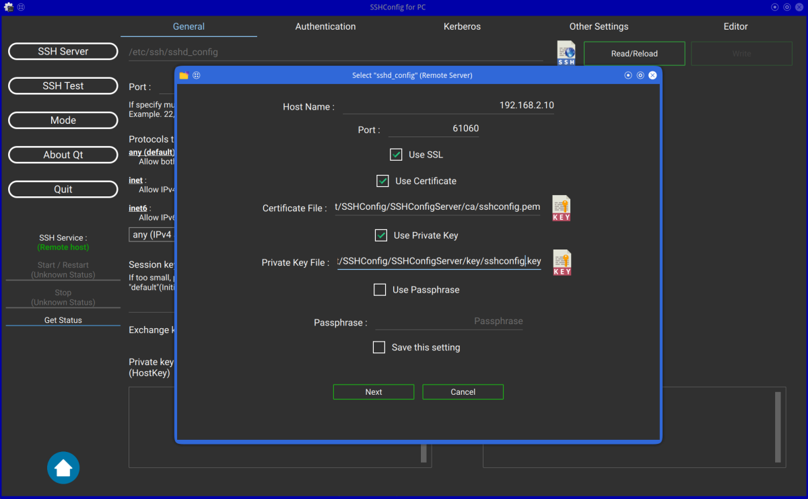|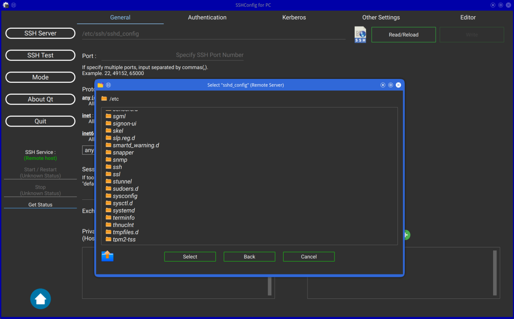|
 

### Settings SSHConfig application  

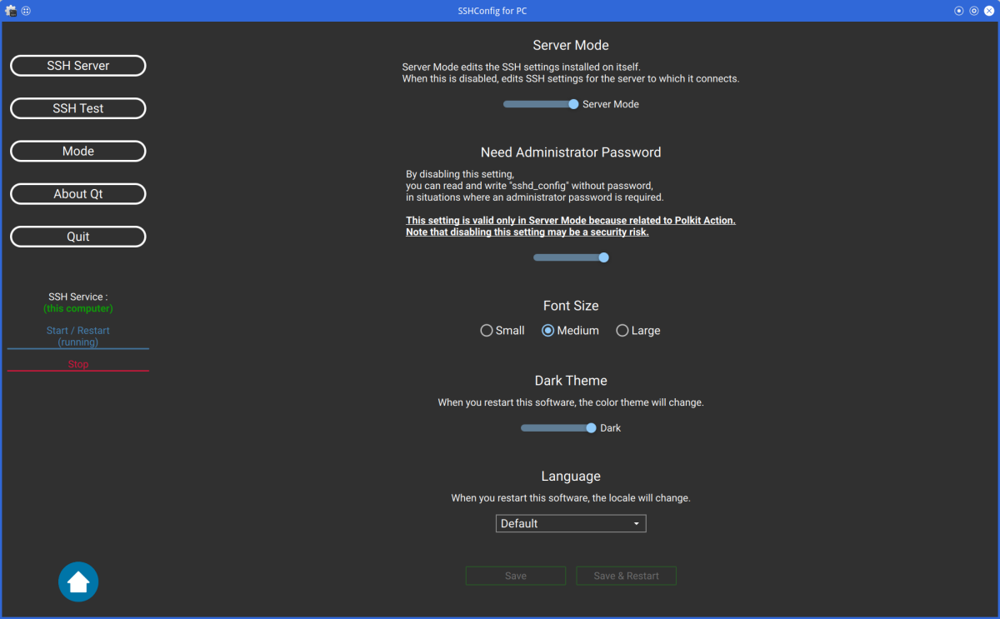
  
 

* Server Mode  
  When "Server Mode" is enabled, locally installed SSH can be configured.  
  When "Server Mode" is disabled, you can configure SSH installed on remote server.  
 

* Need Administrator Password  
  When "Server Mode" is enabled, the sshd_config file can be edited without administrative privileges,  
  even if the file requires administrative privileges.  
 

* Font Size  
  Change font size. (plus or minus 3 points)  
 

* Dark Theme  
  Change to Dark Theme.  
  To reflect the settings, the application must be restarted.  
 

* Language  
  Change the language of application.  
  Currently, only English and Japanese can be changed.  
  To reflect the settings, the application must be restarted.  

 

### Test sshd_config
|Testing sshd_config(1) (Server Mode)|Testing sshd_config(2) (Server Mode)|Testing sshd_config(3) (Server Mode)|
|---|---|---|
|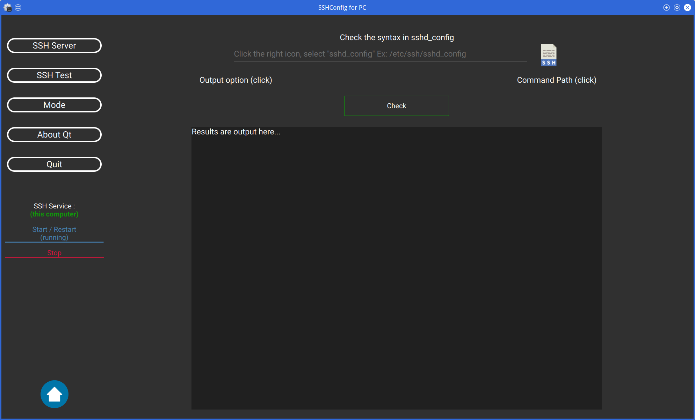|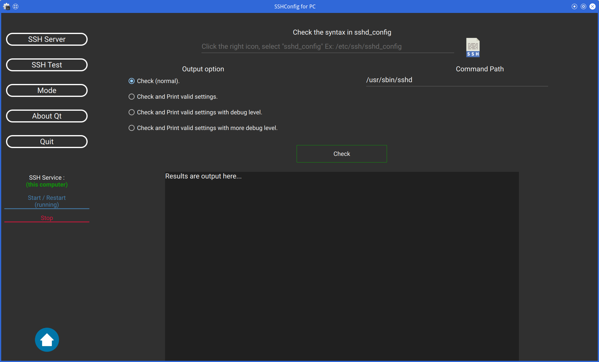|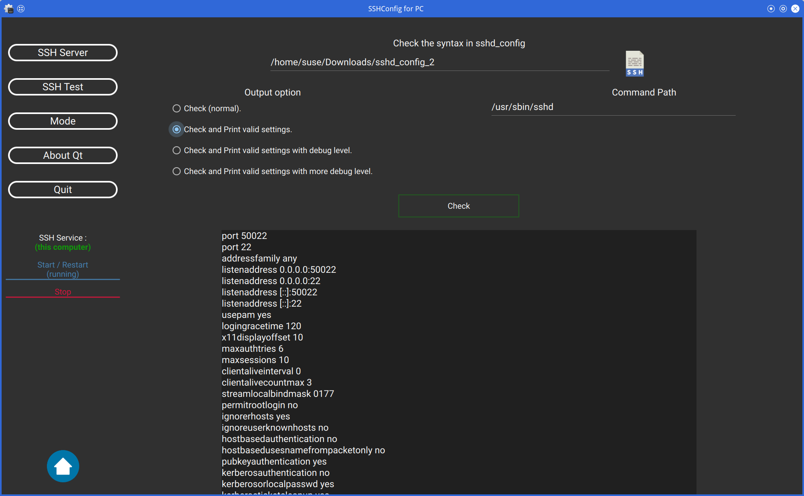|
 

The sshd command can be used to check that the sshd_config file is written correctly.  
You can also specify the options for the sshd command and the path to the sshd command.  
 

Of course, you can also check the sshd_config file on the remote server.  
Then, please disable "Server Mode".  
 

## 5.2 **For PinePhone**
### Main screen  
|SSHConfig Main for PinePhone(1)|SSHConfig Main for PinePhone(2)|SSHConfig Main for PinePhone(3)|
|---|---|---|
|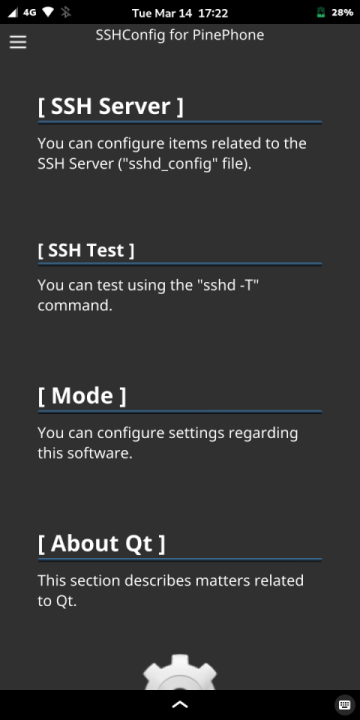|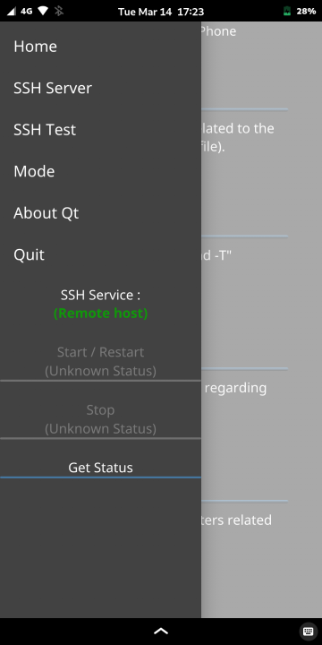|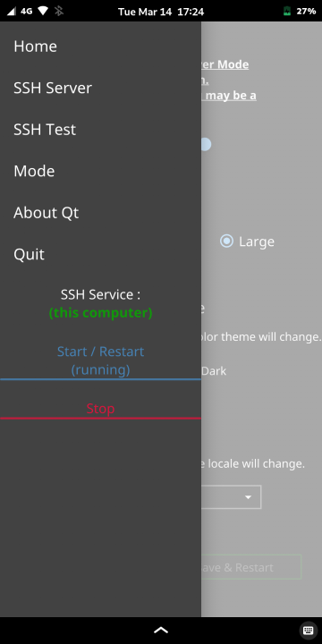|
 

There are no buttons on the left of the main screen, and the Drawer is in the upper left corner.  
Tap this Drawer or flick the PinePhone from the left edge to the right to open the menu.  
 

### Edit ssh configuration  

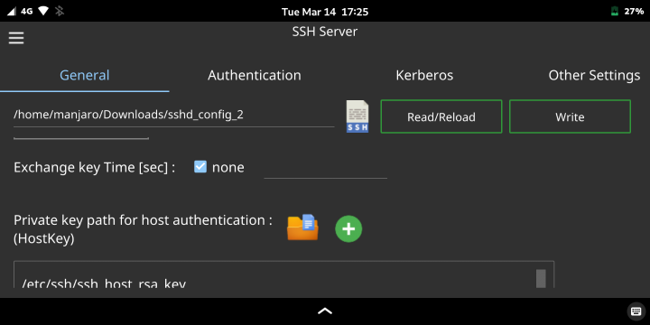
  
 

Same as the PC version.  

 

### Setting SSHConfig application  
Same as the PC version.  

 

### Test sshd_config  
Same as the PC version.  

 
 

# Future
1. Communication control with TCP and SSL/TLS is unstable at times, so the logic needs to be changed.  
   This is especially the case when stopping ssh(d).service with the systemd service.  
 

2. Correct minor drawing errors, etc. as soon as found.  
 

3. Allow editing of SSH client as well as SSH server.  
 

4. "AcceptEnv", "Subsystem" and "Match" keywords should be supported.  
 
 